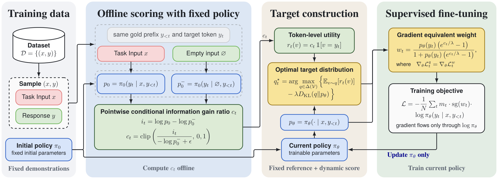
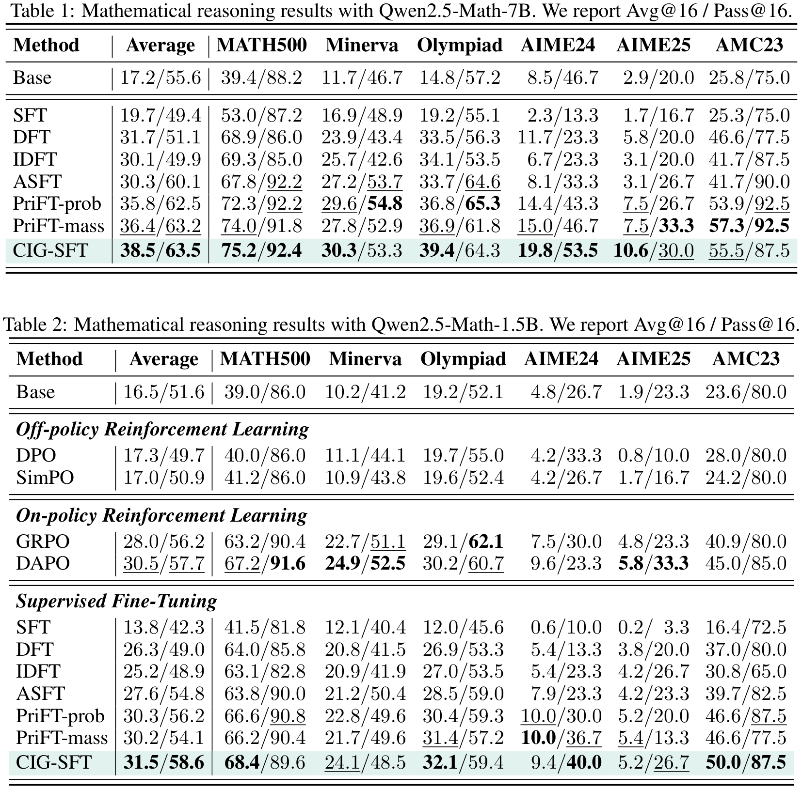
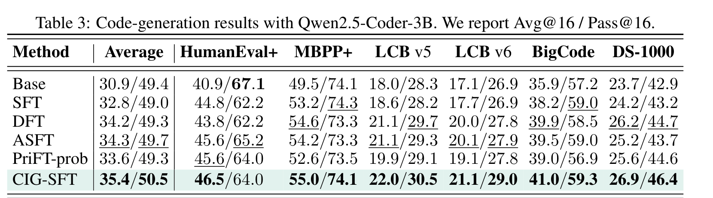

<div align="center">

# Counterfactual Instance Gating <br>for Supervised Fine-Tuning


<div style="font-family: charter; text-align: center; margin: 0 auto;">
                    Anonymous Authors
</div>

<br>
</div>

## 📰 News

* The CIG-SFT training implementation, recipes, example datasets, and usage instructions are available in this repository.

## Abstract

CIG-SFT uses information from the task input to guide token weighting during supervised fine-tuning. For each target
token, it compares a frozen reference model's prediction with and without the task input while keeping the gold
solution prefix fixed. This comparison defines the token's task-conditioned information gain. A KL-regularized
projection converts this signal into a scalar-weighted SFT objective whose logit gradient matches that of the
projected objective. We implement CIG-SFT on top of LlamaFactory and evaluate it on mathematical reasoning and code
generation benchmarks.

## Method



CIG-SFT estimates how much the task input contributes to predicting each target token. Under teacher forcing, a frozen
reference model scores the token with and without the task input. Both evaluations use the same preceding gold
solution tokens, so the comparison isolates the effect of including the input in the reference-model scoring
procedure. The difference in log-likelihoods gives the token's task-conditioned information gain.

The method incorporates this signal through a KL-regularized projection. The resulting scalar-weighted SFT objective
has the same logit gradient as the projection-based objective, while fine-tuning applies the resulting token weights
to the standard cross-entropy loss. The information scores are computed from the frozen reference model and fixed
inputs, then materialised and cached before training.

The implementation is `cig_sft_loss_func` in
[`src/llamafactory/train/trainer_utils.py`](src/llamafactory/train/trainer_utils.py). The integration adds
`use_cig_sft_loss`, `cig_lambda`, `cig_erased_prompt` and `cig_credit_cache`, all off by default. A frozen reference
model is required (`finetuning_type` is `full` or `freeze`); packing and streaming datasets are not supported.

## ⚙️ Installation

Python 3.11, torch 2.6.0+cu124. Create an environment with the manager of your choice, then install the pinned
dependencies and this repository into that active environment:

```bash
git clone <anonymous repository URL>
cd CIG-SFT

# Option A: conda
conda create -n cig-sft python=3.11 pip -y
conda activate cig-sft

# Option B: Python venv
# python3.11 -m venv .venv
# source .venv/bin/activate

bash example/scripts/setup_env.sh
```

This fork of [hiyouga/LLaMA-Factory](https://github.com/hiyouga/LLaMA-Factory) at commit `97b32d31` adds the loss to
nine modified files and one new module (`src/llamafactory/data/erased_prompt.py`); every other file is upstream. See
[`THIRD_PARTY_NOTICES.md`](THIRD_PARTY_NOTICES.md) for provenance. Recipes, datasets and scripts live under `example/`:

```
example/
├── configs/     training recipes (Qwen2.5-Math-1.5B)
├── data/        the built parquet datasets plus dataset_info.json
├── figures/     the method overview and result figures
└── scripts/     setup_env, build_dataset, training wrappers, smoke test
```

Install FlashAttention:

```bash
pip install flash-attn --no-build-isolation
```

## 🚀 Getting Started

### Step 1: Data

The built datasets are under `example/data/`: the math mixtures `numina_cot` (10k / 30k / 100k rows) and the code
mixture `tulu_code` (30k), registered as `cig_sft_numina_cot_{10k,30k,100k}` and `cig_sft_tulu_code_30k`. Rebuild them
from the public sources:

```bash
python example/scripts/build_dataset.py --task numina_cot --sizes 30k
```

### Step 2: Training

#### 1. Generate the weight file

Before optimization, CIG-SFT computes the token weights with the frozen reference model. The output path is configured
by `cig_credit_cache` in `example/configs/qwen2_5_math_1p5b_full_cig_sft.yaml`; the default path is
`example/data/cig_weights/qwen2.5_math_1p5b_numina_cot_30k.pt`. When training starts, the file is generated before the
optimization loop.

#### 2. Start training

Run the published Qwen2.5-Math-1.5B recipe:

```bash
python src/train.py example/configs/qwen2_5_math_1p5b_full_cig_sft.yaml
```

The recipe trains for one epoch with a global batch size of 128 (233 steps). To override a setting, append
`key=value` after the config path. For example:

```bash
python src/train.py example/configs/qwen2_5_math_1p5b_full_cig_sft.yaml model_path=Qwen/Qwen2.5-Math-1.5B
```

### Step 3: Evaluation

We evaluate mathematical reasoning with Qwen2.5-Math-1.5B and Qwen2.5-Math-7B on MATH-500, MinervaMath,
OlympiadBench, AIME24, AIME25, and AMC23. For each problem, we sample 16 responses at temperature 1.0 with a
maximum generation length of 4,096 tokens, and report Avg@16 and Pass@16. We evaluate code generation with
Qwen2.5-Coder-3B on HumanEval+, MBPP+, LiveCodeBench v5/v6, BigCodeBench-Full, and DS-1000.



#### Code-generation results

The code-generation results reported in the paper are shown below.


